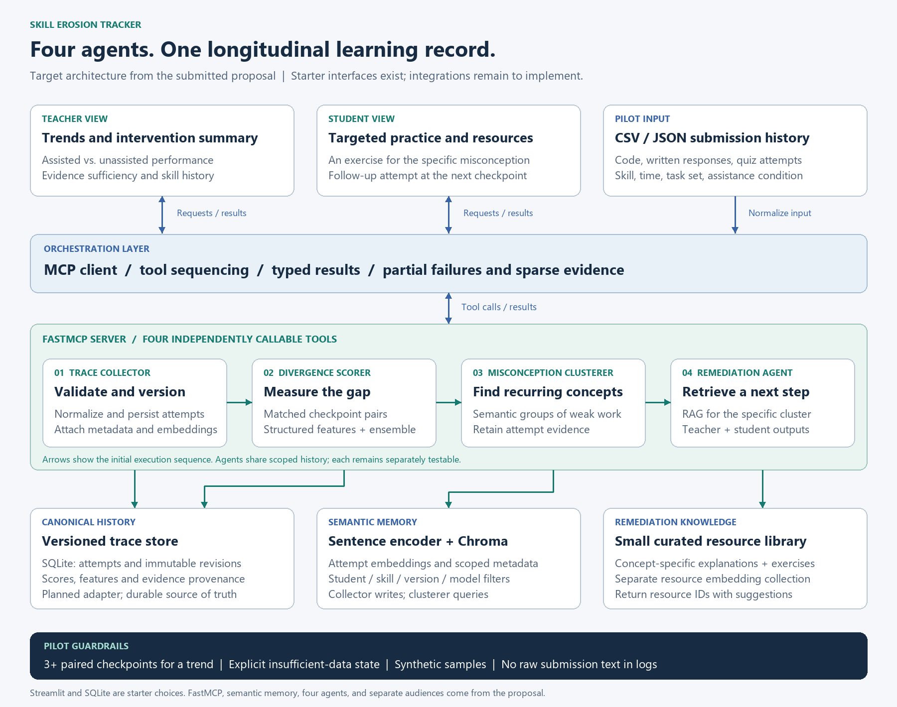

# Multi-Agent Skill Erosion Tracker

A collaborative starter for tracking the difference between assisted and
unassisted student performance across time, based on the submitted proposal.

**Status: project skeleton.** Four agent interfaces and MCP registrations exist;
agent algorithms, persistence, orchestration, and UI data integration are not
implemented. The two UI entry points display clearly labeled starter pages.
No AI-use detection, real student assessment, or trained scoring is provided.



## Start here

- [Architecture and design decisions](docs/architecture.md)
- [Full directory map](docs/directory-map.md)
- [Data contracts and sample records](docs/data-contract.md)
- [Team ownership and GitHub handoff](docs/team-guide.md)
- [Implementation roadmap](docs/roadmap.md)
- [Original submitted proposal](docs/proposal/proposal.pdf)
- [Editable Mermaid diagram](docs/diagrams/architecture.mmd) / [SVG](docs/diagrams/architecture.svg)

## Repository layout

```text
skill-erosion-tracker/
  apps/                       Teacher and student Streamlit starters
  src/skill_erosion/
    agents/                   Four independent agent packages
    contracts/                Shared typed requests and results
    orchestration/            End-to-end journey entry point
    storage/                  Versioned trace and vector-store ports
    embeddings/               Sentence encoder port
    scoring/                  Feature/ensemble implementation work area
    retrieval/                Curated-resource retrieval work area
    privacy/                  Logging and data-handling requirements
    mcp_server.py             Four named FastMCP tools
  config/                     Pilot skill taxonomy
  data/                       Synthetic fixtures and ignored local storage
  resources/remediation/      Curated pilot content
  models/artifacts/           Ignored trained artifacts
  tests/                      Unit, integration, and evaluation work areas
  scripts/                    Scaffold checks and diagram generator
  docs/                       Design, contracts, roadmap, proposal, diagrams
  .github/                    CI, issue template, pull-request template
```

## Local setup

Use Python 3.11 or newer. Open a terminal in this folder.

Windows PowerShell (activation is not required):

```powershell
py -3 -m venv .venv
.\.venv\Scripts\python.exe -m pip install -e .
.\.venv\Scripts\python.exe -m skill_erosion
.\.venv\Scripts\python.exe scripts/check_scaffold.py
```

macOS / Linux:

```bash
python3 -m venv .venv
.venv/bin/python -m pip install -e .
.venv/bin/python -m skill_erosion
.venv/bin/python scripts/check_scaffold.py
```

The commands below use `python` to mean your virtual environment's interpreter.
Install optional packages only for the area you are developing:

```bash
python -m pip install -e ".[mcp,ui]"
python -m skill_erosion.mcp_server
```

The local MCP endpoint is `http://127.0.0.1:8000/mcp`. Tool discovery is available;
all four agent calls intentionally raise `NotImplementedError` until implemented.
This is an MCP endpoint, not a REST API or a browser dashboard.

Open two additional terminals for the UI starters:

```bash
python -m streamlit run apps/teacher_dashboard/app.py --server.port 8501 --server.address 127.0.0.1
python -m streamlit run apps/student_portal/app.py --server.port 8502 --server.address 127.0.0.1
```

Visit `http://localhost:8501` and `http://localhost:8502`. These pages are not yet
connected to the MCP server. The optional `intelligence` extra lists the planned
Chroma, sentence encoder, and ensemble dependencies; no model download is required
to inspect or check the scaffold. `.env.example` documents future adapter settings;
it is not read by any current code.

## Checks

```bash
python -m compileall -q src apps scripts
python scripts/check_scaffold.py
```

CI runs syntax, import, and fixture-consistency checks. These are scaffold checks,
not model-accuracy tests. Add behavioral tests as each agent is implemented.
Dependency ranges are starter constraints, not a lockfile; the team should lock a
tested environment after selecting the encoder and scoring approach.

## Put this on GitHub

Upload the **contents of this folder** as your repository root. Include `.github`,
`.gitignore`, and `.env.example`. Do not upload `.venv`, caches, databases, raw
student data, or the ZIP itself. No remote repository has been created or changed.
See [the team guide](docs/team-guide.md) for a suggested branch and review workflow.

## Technical references

Tool registration and local HTTP transport follow the
[official FastMCP documentation](https://gofastmcp.com/v2/deployment/running-server).
UI launch commands follow the
[official Streamlit configuration documentation](https://docs.streamlit.io/develop/concepts/configuration/options).
