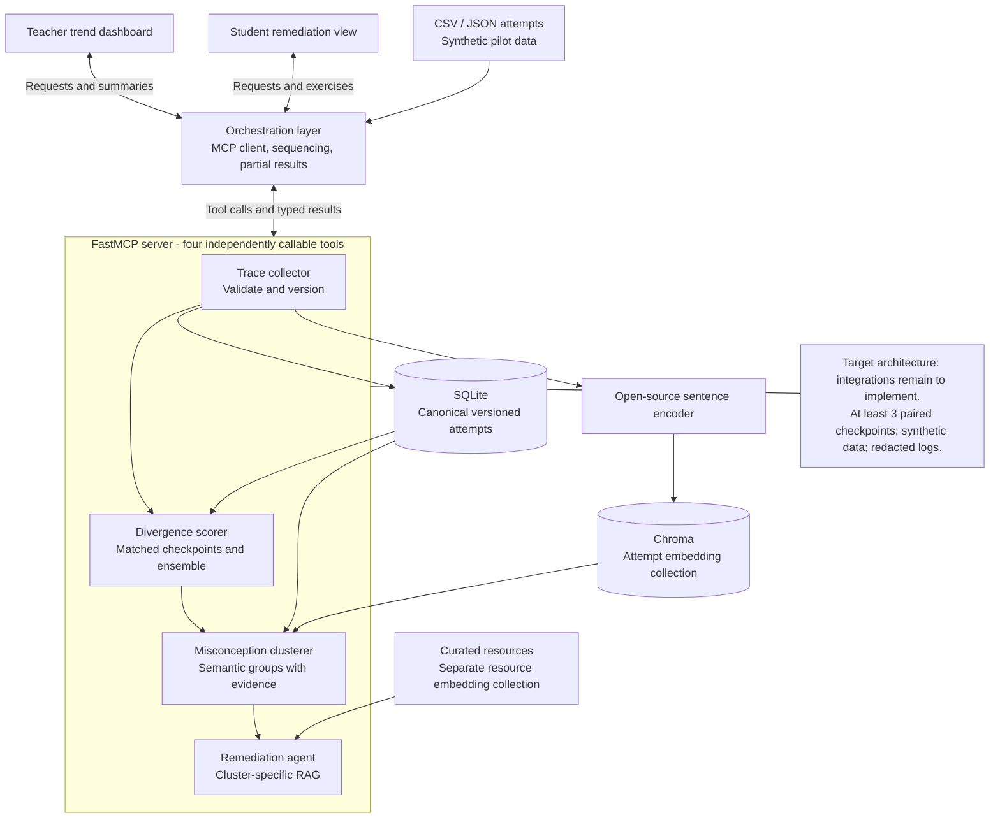

# Architecture

This is the target design for the submitted proposal, with source boundaries
already scaffolded. Diagram arrows describe intended integrations, not completed
features. Source: `docs/proposal/proposal.pdf`, sections 4-8 and 10.

## System flow

1. A JSON/CSV importer normalizes synthetic attempts into `Attempt` records.
2. The orchestration layer calls `collect_traces` through FastMCP. The collector
   validates fields and writes immutable versions into a trace repository. An
   open-source encoder supplies embeddings to a persistent Chroma collection.
3. `score_divergence` reads history for one student and skill. It matches assisted
   and unassisted attempts within comparable task sets and checkpoints. A small
   ensemble uses correctness, duration, hint count, and similarity to prior work.
4. `cluster_misconceptions` uses the weak attempts' embeddings to group recurring
   conceptual errors. It retains the exact attempt/version evidence references.
5. `recommend_remediation` consumes a specific cluster and its trend. RAG retrieves
   a relevant item from a separate curated-resource collection. It returns a
   concise teacher summary and a targeted student exercise, with resource IDs.
6. The teacher and student views consume audience-specific results from the same
   backend state. A later unassisted attempt feeds the next checkpoint.

The first implementation can orchestrate the tools sequentially. Scoring and
clustering may later run independently after ingestion; no queue or microservice
split is required for this pilot.

## Components and ownership

| Component | Responsibility | Source boundary |
|---|---|---|
| Trace collector | Normalize, validate, version, index | `agents/trace_collector/` |
| Divergence scorer | Comparable pairs and longitudinal ensemble scores | `agents/divergence_scoring/`, `scoring/` |
| Misconception clusterer | Semantic groups with evidence | `agents/misconception_clustering/`, `embeddings/` |
| Remediation agent | Cluster-specific RAG and two outputs | `agents/remediation/`, `retrieval/` |
| MCP server | Expose each agent independently | `mcp_server.py` |
| Orchestrator | Tool order, timeouts, partial results | `orchestration/pipeline.py` |
| Persistent state | Append-only attempts plus derived vector index | `storage/` |
| Teacher view | Paired score trends and intervention summary | `apps/teacher_dashboard/` |
| Student view | Next exercise and source resource | `apps/student_portal/` |

All backend paths in this table are relative to `src/skill_erosion/`.

## Decisions added for the starter

The proposal does not prescribe folder names or a UI framework. This scaffold
chooses a Python monorepo and two Streamlit entry points to reduce initial setup.
A React UI could replace these without changing the agent contracts. Separate
service repositories would add deployment/contract coordination before the pilot
needs it, so the four agents are modules exposed as independent tools.

SQLite is proposed as the canonical versioned attempt store. Chroma is a derived
semantic index, not the only record of submission history. This makes version
auditing and rebuilding embeddings explicit. Keep model name/version with every
embedding and do not mix encoders in a collection. The SQLite adapter, schema
migrations, Chroma adapter, and resource index are still implementation tasks.

FastMCP is the tool boundary required by the proposal. The planned Streamlit
server-side adapters use an MCP client and the shared orchestrator; browser code
does not call a raw MCP URL. A conventional REST layer is unnecessary for the
current starter and can be added if the team changes frontend technology.

## Integrity and failure behavior to implement

- Compare tasks only when student, skill, checkpoint, matched task set, and rubric
  agree. Skill tags alone do not establish equivalent task difficulty.
- Preserve revisions. Reimporting the same `(attempt_id, version)` and content is
  a no-op; a conflicting payload is rejected. Scoring uses the latest version once.
- Require at least three paired, ordered checkpoints before assigning a trend;
  return `insufficient_data` when this evidence is missing.
- Keep both absolute performance series alongside the gap. A widening gap with
  improving unassisted skill warrants review and may be `contradictory`; it does
  not by itself establish AI-caused deterioration.
- Store canonical traces before indexing. Track indexing status and retry only
  missing version keys so a failed encoder call does not silently lose attempts.
- If no weak attempts or too little semantic evidence exist, return no clusters.
  If no resource matches a cluster, return `no_matching_resource`.
- Use scoped student/skill retrieval. Add authorization before any real-data use.
  Logs should allowlist metadata; raw submission text and tool arguments must not
  enter dashboard logs. Timeout/retrieval failures must not erase valid trend data.

These are acceptance criteria, not controls claimed to exist in the scaffold.

## Proposal traceability

| Proposal requirement | Scaffold location | Remaining implementation |
|---|---|---|
| Four independent FastMCP tools | `mcp_server.py`, four agent packages | Agent bodies |
| Versioned longitudinal traces | `contracts/`, `storage/interfaces.py` | Validation/import/persistence |
| Assisted/unassisted comparable tasks | `Attempt`, synthetic JSON/CSV | Matching and rubric checks |
| At least 3 checkpoints | Widening/stable/narrowing fixtures | Ensemble and trend policy |
| Semantic clustering | Encoder/index ports, clustering package | Model selection and clustering |
| Cluster-specific RAG | Resource catalog, remediation package | Resource indexing and retrieval |
| Two audiences | Separate apps, `RemediationPlan` | Data binding and role controls |
| Sparse history | Sparse fixture, status contract | Graceful result path |
| Privacy | `.gitignore`, privacy work-area notes | Redaction and real-data controls |
| Full student journey | `run_journey`, integration test backlog | Tool wiring and end-to-end demo |

## Current verification scope

`scripts/check_scaffold.py` validates synthetic record structure, pairing,
timestamps, expected fixture trends, resource paths, and core module imports.
It does not run a trained ensemble, semantic clustering, persistence, or RAG.

## Editable diagram

